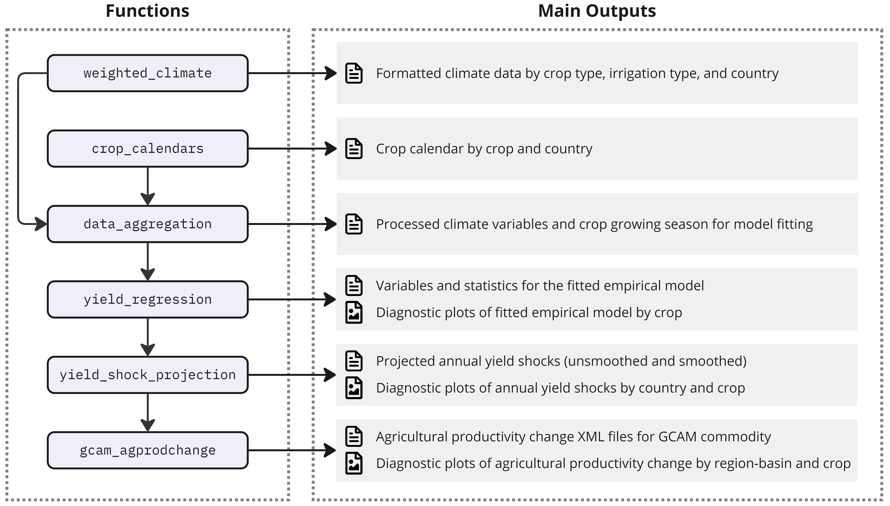

# Summary

`gaea` is an open-source R package designed to estimate crop yield shocks in response to annual climate variations and CO2 concentrations at the country scale for 12 major crops. This innovative tool streamlines the workflow from raw climate data processing to the production of different forms of yield shock, such as agricultural productivity changes at the region-basin level, which can be directly integrated into the latest Global Change Analysis Model (GCAM) [@Bond-Lamberty_2024; @Calvin_2019]. At its core, `gaea` employs an empirical econometric model that leverages historical crop yield data (e.g., from [FAOSTAT](https://www.fao.org/faostat/en/#data/QCL)) and climate data for robust empirical fitting across diverse country-crop-climate combinations. `gaea` is fully compatible with the widely-used climate data from the Coupled Model Intercomparison Project Phase 6 (CMIP6), bias-adjusted by the Inter-Sectoral Impact Model Intercomparison Project ([ISIMIP](https://www.isimip.org/)). For future projections, the package aggregates global gridded precipitation and temperature data to the national level, weighted by cropland area derived from MIRCA [@Portmann_2010]. This approach enables the projection of annual yield shocks under various future climate scenarios, differentiated by crop type, country, and time. More broadly, `gaea` serves as a lightweight yet powerful model that equips researchers with the tools to explore the possibility space of global crop yields responses to future climate uncertainties, enhancing human-Earth system analysis capabilities.

# Statement of need

The global agricultural market, closely connected with energy and water systems, is highly responsive to climate change. Improving the representation of agricultural dynamics in global multi-sector models is the key to better understanding the human-Earth system interactions. While the impacts of mean historical and future climate change on crop yields have been extensively studied, there is a notable gap in understanding how climate variability affects crop yields and how these impacts evolve over time [@Ray_2015]. Multisector dynamics models such as GCAM, rely on exogenous inputs of yield responses to climate impacts as key drivers in simulating the co-evolution of energy, water, and land systems under future uncertainties. However, the current crop modeling landscape lacks globally comprehensive, computationally efficient, validated models capable of simulating yield responses to both inter-annual variability and long-term trends across a wide range of climate change scenarios and crop types [@Waldhoff_2020]. To address the gap, we have develop `gaea`, an empirical econometric model with capabilities to capture shocks to yields of a wide range of crops (cassava, cotton, maize, rice, potatoes, sorghum, soybean, sugarbeet, sugarcane, sunflower, and wheat) at country scales considering interannual climate variability. The detailed methodology is described in @Waldhoff_2020.

# States of the Field

The exploration of future climate change impacts on agricultural production is crucial for providing insights into global food security. Various crop models, including process-based and empirical models, have been developed to simulate crop yields under different climate scenarios [@Chapagain_2022; @Rauff_2015]. @Muller_2017 conducted a global gridded crop model (GGCM) intercomparison experiment involving 14 crop models, including the widely-used Decision Support System for Agrotechnology Transfer (DSSAT) model [@Jones_2003]. DSSAT allows users to simulate diverse crop management options and associated risks by integrating knowledge on crops, soil, climate, and management practices. Another comparable tool is `osiris` [@Ahsan_2023], an emulator designed to process climate impacts on agricultural yields using gridded yield outputs from existing GGCMs. However, the yield responses to precipitation and temperature variations simulated by GGCMs are generally less sensitive compared to the reduced-form econometric models [@Mistry_2017] employed by `gaea`. In the multisector dynamics modeling field, there is a growing need for the crop models that can strike a balance between simulation fidelity and lightweight modeling capabilities. Such models are essential for exploring future climate scenarios with global coverage. `gaea` achieves this balance by employing computationally efficient statistical methods to model 12 major crops globally, while maintaining the sensitivity to capture both gradual climate changes and interannual variability impacts on crop yields.

# Functionality

`gaea` is designed with a climate-driven empirical model at its core, integrated into an efficient modular structure. This architecture streamlines the entire workflow, from initial climate and crop data processing through empirical model fitting, yield shock projections under future climate scenarios, to the calculation of agricultural productivity changes for GCAM. The modular design also facilitates comprehensive diagnostic outputs, enhancing the tool's utility for researchers and policymakers.

The primary functionality of `gaea` is encapsulated in the `yield_impact` wrapper function, which executes the entire workflow from climate data processing to yield shock estimation. Users can also execute individual functions to work through the main steps of the process (\autoref{fig:workflow}). Detailed instructions on `gaea` can be accessed at https://jgcri.github.io/gaea.

1. `weighted_climate`: Processes CMIP-ISIMIP climate NetCDF data and calculates cropland-weighted precipitation and temperature at the country level, differentiated by crop type and irrigation type. The function accepts both daily or monthly climate data.
2. `crop_calenders`: Generates crop planting months for each country based on crop calendar data [@Sacks_2010].
3. `data_aggregation`: Calculates crop growing seasons using climate variables processed by `weighted_climate` and crop calendars for both historical and projected periods. This function prepares climate and yield data for subsequent model fitting.
4. `yield_regression`: Performs regression analysis based on historical crop yields and climate variations. The default econometric model applied in `gaea` is from @Waldhoff_2020. User can provide other formulas as long as it is using the same data from `data_aggregation`.
5. `yield_projection`: Projects yield shocks for future climate scenarios using the fitted model.
6. `gcam_agprodchange`: Remaps country-level yield shocks to GCAM-required spatial scales (i.e., region and basin intersections) based on harvest area and converts crops to GCAM commodities. This function calculates agricultural productivity growth (a key parameter for GCAM to estimate future yield) and creates ready-to-use XML outputs for GCAM.

# Acknowledgements
This research was supported by the US Department of Energy, Office of Science, as part of research in MultiSector Dynamics, Earth and Environmental System Modeling Program. The Pacific Northwest National Laboratory is operated for DOE by Battelle Memorial Institute under contract DE-AC05-76RL01830. The views and opinions expressed in this paper are those of the authors alone.

# References
