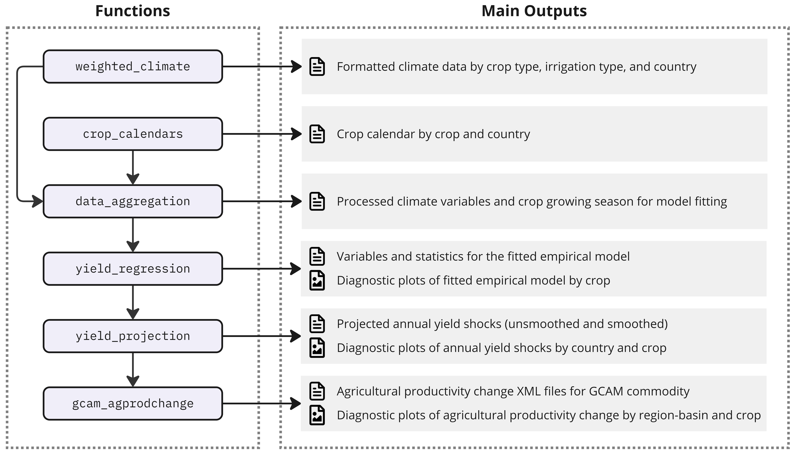
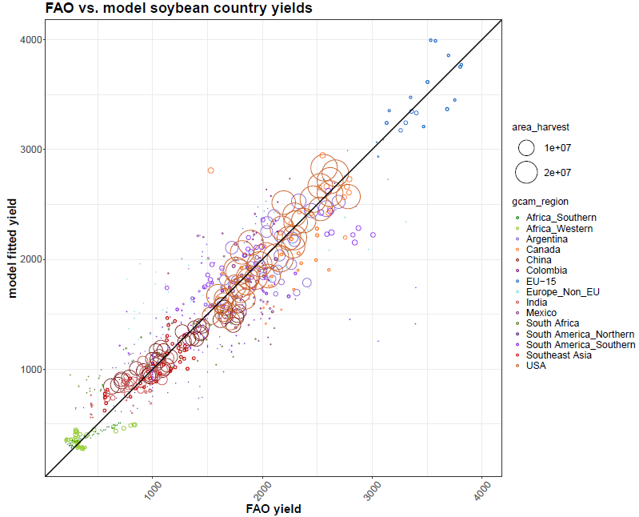
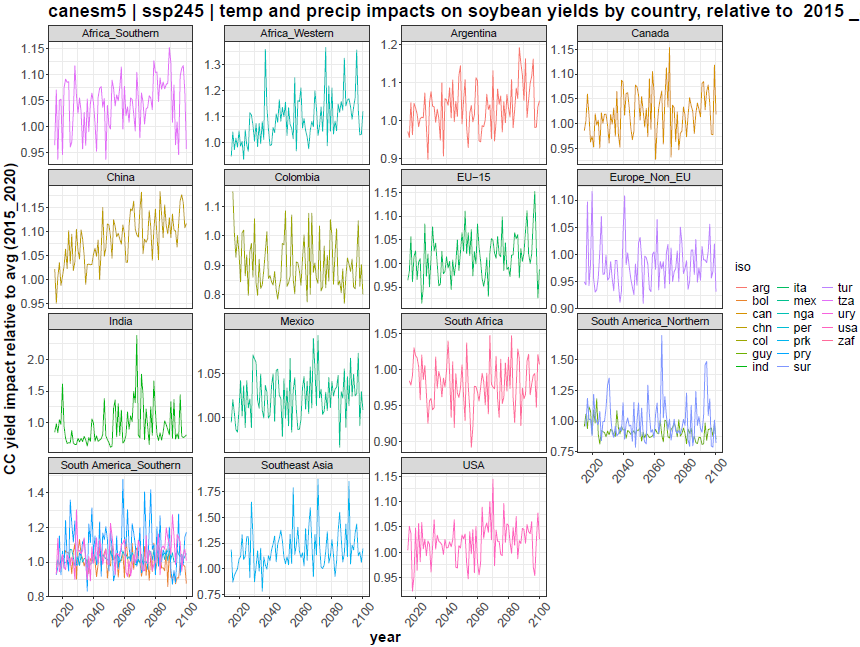
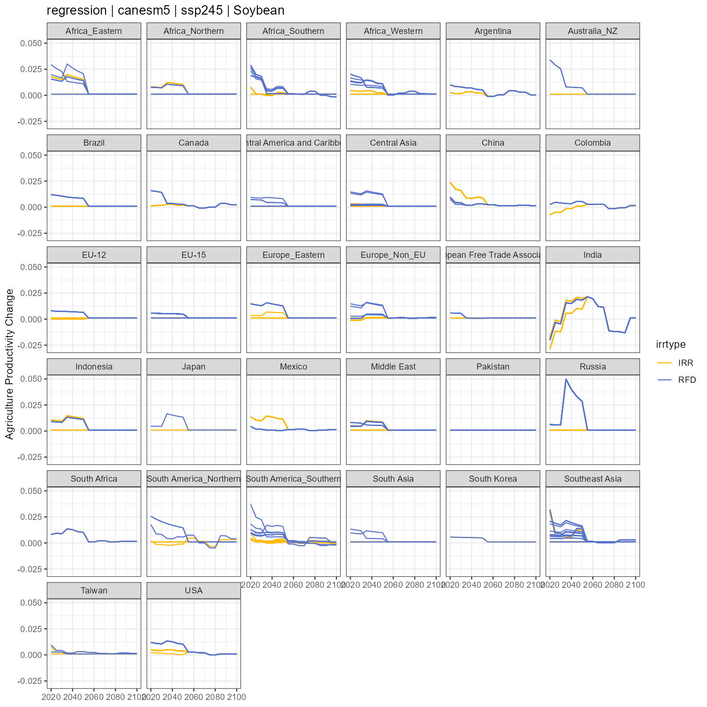

```{r setup, include=FALSE} 
knitr::opts_chunk$set(warning = FALSE, message = FALSE) 
```

<!-------------------------->
<!-------------------------->

<!-- HTML styles items    -->

<!-------------------------->
<!-------------------------->

```{=html}
<style>
.button {
  background-color: #555555;
  border-radius: 8px;
  border: none;
  color: white;
  padding: 15px 32px;
  text-align: center;
  text-decoration: none;
  display: inline-block;
  font-size: 16px;
  margin: 4px 2px;
  cursor: pointer;
}

.button:hover {
  box-shadow: 0 12px 16px 0 rgba(0,0,0,0.24), 0 17px 50px 0 rgba(0,0,0,0.19);
  background-color: #555555;
  color: gold;
}

p.comment {
background-color: #DBDBDB;
padding: 10px;
border: 1px solid black;
margin-left: 25px;
border-radius: 5px;
font-style: italic;
}

</style>
```
<!-------------------------->
<!-------------------------->

# Workflow

<!-------------------------->
<!-------------------------->

<p align="center"></p>


`gaia` is designed with a climate-driven empirical model at its core, integrated into an efficient modular structure. This architecture streamlines the entire workflow. This workflow includes raw climate and crop data processing, empirical model fitting, yield shock projections under future climate scenarios, and agricultural productivity change calculation for GCAM. The modular design also facilitates comprehensive diagnostic outputs, enhancing the tool's utility for researchers and policymakers.


The primary functionality of `gaia` is encapsulated in the `yield_impact` wrapper function, which executes the entire workflow from climate data processing to yield shock estimation. Users can also execute individual functions to work through the main steps of the process ([Figure 1](#figure1)).


1. [`weighted_climate`](#weighted_climate): Processes CMIP-ISIMIP climate NetCDF data and calculates cropland-weighted precipitation and temperature at the country level, differentiated by crop type and irrigation type. The function accepts both daily or monthly climate data that are consistent with the CMIP-ISIMIP NetCDF data format.   

2. [`crop_calendars`](#crop_calendars): Generates crop planting months for each country and crop based on crop calendar data [Sacks et al., (2010)](https://doi.org/10.1111/j.1466-8238.2010.00551.x).

3. [`data_aggregation`](#data_aggregation): Calculates crop growing seasons using climate variables processed by `weighted_climate` and crop calendars for both historical and projected periods. This function prepares climate and yield data for subsequent model fitting.

4. [`yield_regression`](#yield_regression): Performs regression analysis fitted with historical annual crop yields, monthly growing season temperature and precipitation, CO2 concentrations, GDP per capita, and year. The default econometric model applied in `gaia` is from [Waldhoff et al., (2020)](https://doi.org/10.1088/1748-9326/abadcb). User can specify alternative formulas that are consistent with the data processed in `data_aggregation.`

5. [`yield_shock_projection`](#yield_shock_projection): Projects yield shocks for future climate scenarios using the fitted model and temperature, precipitation, and CO2 projections from the climate scenario.

6. [`gcam_agprodchange`](#gcam_agprodchange): Remaps country-level yield shocks to GCAM-required spatial scales (e.g., region, basin, and intersections), based on harvested areas, and aggregates crops to GCAM commodities. This function applies the projected shocks to GCAM scenario agricultural productivity growth rates (the unit used to project future yields in GCAM) and creates ready-to-use XML outputs for GCAM.

<br />

<p align="center"></p>
<a name="figure1"></a>
<p align="left" style="font-size:14px;"> **Figure 1:** The gaia workflow showing the functions and the corresponding outputs of modeling crop yield shocks to climate variations using empirical econometric model. </p>

<br />


<!-------------------------->
<!-------------------------->

# Example Climate Data

<!-------------------------->
<!-------------------------->

<p align="center"></p>


`gaia` requires global climate data from the Inter-Sectoral Impact Model Intercomparison Project ([ISIMIP](https://www.isimip.org/)) or data formatted similarly to ISIMIP data. Additionally, `gaia` supports climate data aggregated to a monthly time step. Due to the large size of daily time step climate data, we have provided an example of monthly aggregated climate data covering the period from 2015 to 2100.

<br />

## Example Data 1

Download the example data using the instructions below. This dataset includes both historical climate observations and future climate projections, already weighted by cropland areas and provided in .txt format. The cropland-area-weighted, country-level climate data contains monthly precipitation and temperature for 26 crop types, distinguishing between irrigated and rainfed areas.


```{r eval=F}

# load gaia
library(gaia)

# Path to the output folder. Change it to your desired location
output_dir <- file.path(getwd(), 'gaia_output')

# Cropland-weighted historical and future climate data
data_dir <- gaia::get_example_data(
  download_url = 'https://zenodo.org/records/13976521/files/weighted_climate.zip?download=1',
  data_dir = output_dir
)

# Path to the folder that holds cropland-area-weighted precipitation and temperature TXT files
# historical climate observation
climate_hist_dir <- file.path(data_dir, 'climate_hist')
# future projected climate
climate_impact_dir <- file.path(data_dir, 'canesm5')

```


<br />

<div class="alert alert-info">
<strong>NOTE!</strong> We recommend using the default historical climate data provided in [example data 1](#example-data-1), as it is based on WATCH climate observations ([Weedon et al., (2011)](https://doi.org/10.1175/2011JHM1369.1)). If you do not plan to adjust any assumptions for empirical model fitting, you can opt to use the default regression model, pre-fitted with the WATCH historical climate data, by setting the argument `use_default_coeff = TRUE`. After loading the `gaia` package, type `coef_default` to view the parameters of the default fitted model..
</div>

<br />

## Example Data 2

To use a different climate model or scenario, you can provide your own climate data in NetCDF format. Note that `gaia` adheres to the ISIMIP climate data format as its standard, so your NetCDF files should be formatted accordingly. You can download our example monthly precipitation and temperature NetCDF files using the code below.


```{r eval=F}

# load gaia
library(gaia)

# Path to the output folder. Change it to your desired location
output_dir <- file.path(getwd(), 'gaia_output')

# Future Climate Data
data_dir <- gaia::get_example_data(
  download_url = 'https://zenodo.org/records/13976521/files/gaia_example_climate.zip?download=1',
  data_dir = output_dir
)

# Path to the precipitation and temperature NetCDF files
# NOTE: Each variable can have more than one file
# projected climate data
pr_projection_file <- file.path(data_dir, 'pr_monthly_canesm5_w5e5_gcam-ref_2015_2100.nc')
tas_projection_file <- file.path(data_dir, 'tas_monthly_canesm5_w5e5_gcam-ref_2015_2100.nc')

```


<br />

<!-------------------------->
<!-------------------------->

# Run gaia!

<!-------------------------->
<!-------------------------->

<p align="center"></p>

## Example 1

<div class="alert alert-dismissible alert-warning">
  <button type="button" class="btn-close" data-bs-dismiss="alert"></button>
  <h4 class="alert-heading">Warning!</h4>
  <p class="mb-0">This example demonstrates the complete `gaia` model workflow, including processing the raw climate NetCDF data. Due to the large size of the climate dataset, this process may take up to an hour. For a quicker demonstration, please refer to [Example 2](#example-2).</p>
</div>

<!-- <div class="alert alert-info"> -->
<!-- <strong>NOTE!</strong> This example demonstrates the complete `gaia` model workflow, including processing the raw climate NetCDF data. Due to the large size of the climate dataset, this process may take up to an hour. For a quicker demonstration, please refer to [Example 2](#example-2). -->
<!-- </div> -->

This example uses both [example data 1](#example-data-1) and [example data 2](#example-data-2). You can run `gaia` using the single function `yield_impact`, which streamlines the entire workflow. For detailed explanations of each argument in `yield_impact`, please refer to the [reference page](https://jgcri.github.io/gaia/reference/yield_impact.html).

```{r eval=F, echo=T}

# load gaia
library(gaia)

# Path to the output folder. Change it to your desired location
output_dir <- file.path(getwd(), 'gaia_output')

# Run gaia
# The full run with raw climate data can take up to an hour
gaia::yield_impact(
  pr_hist_ncdf = NULL,                    # path to historical precipitation NetCDF file (must follow ISIMIP format); only if you wish to use your own historical precipitation observation
  tas_hist_ncdf = NULL,                   # path to historical temperature NetCDF file (must follow ISIMIP format); only if you wish to use your own historical temperature observation
  pr_proj_ncdf = pr_projection_file,      # path to future projected precipitation NetCDF file (must follow ISIMIP format)
  tas_proj_ncdf = tas_projection_file,    # path to future projected temperature NetCDF file (must follow ISIMIP format)
  timestep = 'monthly',                   # specify the time step of the NetCDF data (monthly or daily)
  climate_hist_dir = climate_hist_dir,    # path to the folder that holds cropland weighted historical climate observations
  historical_periods = c(1960:2001),      # vector of historical years selected for fitting
  climate_model = 'canesm5',              # label of climate model name
  climate_scenario = 'gcam-ref',          # label of climate scenario name
  member = 'r1i1p1f1',                    # label of ensemble member name
  bias_adj = 'w5e5',                      # label of climate data for bias adjustment for the global climate model (GCM)
  cfe = 'no-cfe',                         # label of CO2 fertilization effect in the formula (default is no CFE)
  gcam_version = 'gcam7',                 # output is different depending on the GCAM version (gcam6 or gcam7)
  use_default_coeff = FALSE,              # set to TRUE when there is no historical climate data available
  base_year = 2015                        # GCAM base year
  start_year = 2015,                      # start year of the projected climate data
  end_year = 2100,                        # end year of the projected climate data
  smooth_window = 20,                     # number of years as smoothing window
  co2_hist = NULL,                        # historical annual CO2 concentration. If NULL, will use default value
  co2_proj = NULL,                        # projected annual CO2 concentration. If NULL, will use default value
  diagnostics = TRUE,                     # set to TRUE to output diagnostic plots
  output_dir = output_dir                 # path to the output folder
)

```


<div class="alert alert-info">
<strong>NOTE!</strong> The arguments `climate_model`, `climate_scenario`, `member`, `bias_adj`, and `cfe` require specific strings that provide climate model metadata in the output files. These arguments do not impact the `gaia` model simulation itself; they are only used to populate climate data metadata in the outputs.
</div>

<br />

## Example 2

This example only uses the example of **weighted climate data** as described in [example data 2](#example-data-2), which has been processed with cropland weights at the country level. This weighted climate data was generated using `gaia::weighted_climate`. This example serves as a guide to help users format their own data to match the weighted climate data structure if their raw climate data differs from the ISIMIP format. Running `gaia` directly with weighted climate data requires only a few minutes.

```{r eval=F, echo=T}

# load gaia
library(gaia)

# Path to the output folder. Change it to your desired location
output_dir <- file.path(getwd(), 'gaia_output')

# Run gaia
gaia::yield_impact(
  climate_hist_dir = climate_hist_dir,    # path to the folder that holds cropland weighted historical climate observations
  climate_impact_dir = climate_impact_dir,# path to the folder that holds cropland weighted projected climate
  timestep = 'monthly',                   # specify the time step of the NetCDF data (monthly or daily)
  climate_model = 'canesm5',              # label of climate model name
  climate_scenario = 'gcam-ref',          # label of climate scenario name
  member = 'r1i1p1f1',                    # label of ensemble member name
  bias_adj = 'w5e5',                      # label of climate data for bias adjustment
  cfe = 'no-cfe',                         # label of CO2 fertilization effect in the formula (default is no CFE)
  gcam_version = 'gcam7',                 # output is different depending on the GCAM version (gcam6 or gcam7)
  use_default_coeff = FALSE,              # set to TRUE when there is no historical climate data available
  base_year = 2015,                       # GCAM base year
  start_year = 2015,                      # start year of the projected climate data
  end_year = 2100,                        # end year of the projected climate data
  smooth_window = 20,                     # number of years as smoothing window
  co2_hist = NULL,                        # historical annual CO2 concentration. If NULL, will use default value
  co2_proj = NULL,                        # projected annual CO2 concentration. If NULL, will use default value
  diagnostics = TRUE,                     # set to TRUE to output diagnostic plots
  output_dir = output_dir                 # path to the output folder
)

```


Explore the results in your output folder. For a detailed explanation of the output, checkout [Example 3](#example-3)!

<br />

## Example 3

As the `gaia` model runs, intermediate outputs will be generated and saved to the user-specified output folder. For testing purposes, if you follow [Example 2](#example-2) as outlined above without modifying any input data or arguments, you can expect to see the following key results. Below, we provide additional instructions on using each function described in the [Workflow](#workflow) section and explain the associated example outputs.

<br />

### weighted_climate

---

Once you have downloaded [example data 1](#example-data-1) to your desired location, you can use the `weighted_climate` function to calculate the cropland-weighted monthly precipitation and temperature for the projected climate. Please note that this step may take up to an hour to complete.

```{r eval=F, echo=T}
library(gaia)

# Path to the output folder where you wish to save the outputs. Change it accordingly
output_dir <- file.path(getwd(), 'gaia_output')

# calculate weigted climate
weighted_climate(pr_ncdf = pr_projection_file ,
                 tas_ncdf = tas_projection_file ,
                 timestep = 'monthly',
                 climate_model = 'canesm5',
                 climate_scenario = 'gcam-ref',
                 time_periods = seq(2015, 2100, 1),
                 output_dir = output_dir,
                 name_append = NULL)

```

This will create a folder based on the specified `climate_model` argument (e.g., `output_dir/weighted_climate/canesm5`). Inside this folder, you will find files containing precipitation and temperature data weighted by the irrigated and rainfed cropland areas for 26 MIRCA crops. The file structure is organized in columns as follows: `[year, month, 1, 2, 3, ..., 265]`, where the numbers correspond to country IDs. To view the country names associated with these IDs, simply type `gaia::country_id` in the R console after loading the `gaia` package. Below is an example of the structure for the weighted precipitation data for rainfed soybean (`output_dir/weighted_climate/canesm5/anesm5_gcam-ref_month_precip_country_rfc_crop08_2015_2100.txt`).

```{r eval=T, echo=F, message=F, results='hide'}

input_climate <- gaia::input_data(folder_path = file.path(getwd(), 'vignetteFigs'),
                                  input_file = 'canesm5_gcam-ref_month_precip_country_rfc_crop08_2015_2100.txt')

```

```{r eval=TRUE, echo=FALSE}
library(dplyr)
library(kableExtra)
knitr::kable(input_climate[1:12], 
             caption = '**Table 1.** Soybean-area-weighted precipitation from the weighted_climate function.') %>% 
  kable_styling(bootstrap_options = "striped", full_width = T, position = 'center') %>% 
  footnote(general = 'This only shows the first 12 lines of the example data. Value -9999 indicates there is no cropland area for such crop in the country.')
```

<br />

### crop_calendars

---

The crop calendar outlines the planting and harvesting months for each predefined crop across different countries. Users can modify the crop calendar file to add additional crops, following the established format. Below is an example of the crop calendar structure. You can also access the crop calendar output at `output_dir/data_processed/crop_calendar.csv`.

```{r eval=F, echo=T}

# Path to the output folder where you wish to save the outputs. Change it accordingly
output_dir <- file.path(getwd(), 'gaia_output')

# calculate crop calendars
crop_cal <- crop_calendars(output_dir = output_dir)

# print result
crop_cal

```


```{r eval=T, echo=F, message=F, results='hide'}

crop_cal <- gaia::input_data(folder_path = file.path(getwd(), 'vignetteFigs'),
                              input_file = 'crop_calendar.csv')

```


```{r eval=T, echo=F}
library(dplyr)
library(kableExtra)
knitr::kable(crop_cal[1:10], 
             caption = '**Table 2.** Crop calendar') %>% 
  kable_styling(bootstrap_options = "striped", full_width = T, position = 'center') %>% 
  footnote(general = 'This only shows the first 10 lines of the example data.')
```

<br />

### data_aggregation

---

The `data_aggregation` function calculates crop growing seasons using climate variables processed by `weighted_climate` along with crop calendars for both historical and projected periods. This function prepares climate and yield data for subsequent model fitting.

The `data_aggregation` function creates two types of files in the output_dir/data_processed folder:

* `historic_vars_[crop-name].csv`: This file contains historical data for each crop. For example, historical information for soybean is illustrated in Table 3.

* `weather_[climate-model]_[climate-scenario]_[crop-name].csv`: This file includes aggregated climate data for the specified crop. An example of climate information for soybean is shown in Table 4.


```{r eval=F, echo=T}

# Path to the output folder where you wish to save the outputs. Change it accordingly
output_dir <- file.path(getwd(), 'gaia_output')

# aggregate crop and climate information at the country level
data_agg <- data_aggregation(climate_hist_dir = climate_hist_dir,
                             climate_impact_dir = climate_impact_dir,
                             climate_model = 'canesm5',
                             climate_scenario = 'gcam-ref',
                             output_dir = output_dir)

```

```{r eval=T, echo=F, message=F, results='hide'}

crop_projection <- gaia::input_data(folder_path = file.path(getwd(), 'vignetteFigs'),
                                    input_file = 'weather_canesm5_gcam-ref_soybean.csv')

crop_hist <- gaia::input_data(folder_path = file.path(getwd(), 'vignetteFigs'),
                              input_file = 'historic_vars_soybean.csv')

```

```{r eval=T, echo=F}
library(dplyr)
library(kableExtra)

knitr::kable(crop_hist[1:10], 
             caption = '**Table 3.** Aggregated historical information for soybean.') %>% 
  kable_styling(bootstrap_options = "striped", full_width = T, position = 'center') %>% 
  footnote(general = 'This only shows the first 10 lines of the example data.')


knitr::kable(crop_projection[1:10], 
             caption = '**Table 4.** Aggregated weather information for soybean.') %>% 
  kable_styling(bootstrap_options = "striped", full_width = T, position = 'center') %>% 
  footnote(general = 'This only shows the first 10 lines of the example data.')

```

<br />

### yield_regression

---

The `gaia::yield_regression` function performs empirical model fitting and generates diagnostic plots comparing modeled yields to FAO recorded yields for each crop type at the GCAM region scale. An example of this comparison for soybean is illustrated in [Figure 2](#figure2).


```{r eval=F, echo=T}

# Path to the output folder where you wish to save the outputs. Change it accordingly
output_dir <- file.path(getwd(), 'gaia_output')

# perform empirical regression
yield_regression(diagnostics = TRUE,
                 output_dir = output_dir)

```


<p align="center"></p>
<a name="figure2"></a>
<p align="left" style="font-size:14px;"> **Figure 2:** Model fitted yields versus FAO yields for soybean. </p>

<br />

The parameters of the fitted model can be found in the file located at `output_dir/data_processed/reg_out_[crop-name]_fit_lnyield_mmm_quad_noco2_nogdp.csv`.

```{r eval=T, echo=F, message=F, results='hide'}

fit_model <- gaia::input_data(folder_path = file.path(getwd(), 'vignetteFigs'),
                              input_file = 'reg_out_soybean_fit_lnyield_mmm_quad_noco2_nogdp.csv')

```


```{r eval=T, echo=F}
library(dplyr)
library(kableExtra)
knitr::kable(fit_model[1:10], 
             caption = '**Table 5.** Fitted model for soybean.') %>% 
  kable_styling(bootstrap_options = "striped", full_width = T, position = 'center') %>% 
  footnote(general = 'This only shows the first 10 lines of the example data.')
```

<br />

### yield_shock_projection

---

Once the `gaia` model has completed fitting, the `gaia::yield_shock_projection` function calculates the projected annual yield shocks based on the input climate data. For coarse-scale models like GCAM, `gaia` also computes smoothed yield shocks using a user-specified smoothing window (the default window is 20 years). In the smoothed outputs, the yield shocks at the base year will be set to 1. The results are provided in both `CSV` outputs and diagnostic plots. An example of annual soybean yield shocks is illustrated in [Figure 3](#figure3).


```{r eval=F, echo=T}

# Path to the output folder where you wish to save the outputs. Change it accordingly
output_dir <- file.path(getwd(), 'gaia_output')

# calculate projected yield shocks
out_yield_shock <- yield_shock_projection(use_default_coeff = FALSE,
                                          climate_model = 'canesm5',
                                          climate_scenario = 'gcam-ref',
                                          base_year = 2015,
                                          start_year = 2015,
                                          end_year = 2100,
                                          smooth_window = 20,
                                          diagnostics = TRUE,
                                          output_dir = output_dir)

```

<p align="center"></p>
<a name="figure3"></a>
<p align="left" style="font-size:14px;"> **Figure 3:** Projected yield shocks for soybean. </p>

<br />

The output data for annual and smoothed yield shocks projection are located under folders `output_dir/yield_impacts_annual` (Table 6)  and `output_dir/yield_impacts_smooth` (Table 7). 


```{r eval=T, echo=F, message=F, results='hide'}

annual_yield <- gaia::input_data(folder_path = file.path(getwd(), 'vignetteFigs'),
                                 input_file = 'annual_yield_canesm5_gcam-ref_soybean.csv')

smooth_yield <- gaia::input_data(folder_path = file.path(getwd(), 'vignetteFigs'),
                                 input_file = 'smoothed_yield_canesm5_gcam-ref_soybean.csv')

```

```{r eval=T, echo=F}
library(dplyr)
library(kableExtra)

knitr::kable(annual_yield[1:10], 
             caption = '**Table 6.** Annual yield shocks for soybean.') %>% 
  kable_styling(bootstrap_options = "striped", full_width = T, position = 'center') %>% 
  footnote(general = 'This only shows the first 10 lines of the example data.')


knitr::kable(smooth_yield[1:10], 
             caption = '**Table 7.** 20-year smoothed yield shocks for soybean.') %>% 
  kable_styling(bootstrap_options = "striped", full_width = T, position = 'center') %>% 
  footnote(general = 'This only shows the first 10 lines of the example data.')

```

<br />

### gcam_agprodchange

---

The `gcam_agprodchange` function is specifically designed for the Global Change Analysis Model (GCAM). GCAM requires the agricultural productivity growth rate (APG) as an input, which is calculated based on yield shocks and the baseline APG, varying according to different SSP scenarios. Additionally, the APG for GCAM must be at the region-basin scale. The `gaia::gcam_agprodchange` function directly remaps country-level yield shocks to region-basin APG. In the example below, since `climate_scenario = 'gcam-ref'`, it will use the APG without SSP impact (Reference scenario APC) to calculate the climate-impacted APG based on the yield shocks computed in the previous step.

```{r eval=F, echo=T}

# Path to the output folder where you wish to save the outputs. Change it accordingly
output_dir <- file.path(getwd(), 'gaia_output')

# calculate region-basin agricultural productivity growth rate for GCAM
gcam_apg <- gcam_agprodchange(data = out_yield_shock,
                              climate_model = 'canesm5',
                              climate_scenario = 'gcam-ref',
                              member = 'r1i1p1f1',
                              bias_adj = 'w5e5',
                              cfe = 'no-cfe',
                              gcam_version = 'gcam7',
                              diagnostics = TRUE,
                              output_dir = output_dir)

```

<br />

Once the run is complete, a folder named `[gcam-version]_agprodchange_[cfe]` (e.g., `gcam7_agprodchange_no-cfe`) will be created in your specified output location. This folder contains the `XML` file of the agricultural productivity growth rate (APG) for GCAM. Additionally, it includes diagnostic figures illustrating the APG by region-basin. An example of APG for soybean is shown in [Figure 4](#figure4) below.

<p align="center"></p>
<a name="figure4"></a>
<p align="left" style="font-size:14px;"> **Figure 4:** Agricultural productivity growth rate for soybean. Each line under a region indicates the APG for the region-basin intersection. </p>

<br />

<a href="#top">Back to top</a>
