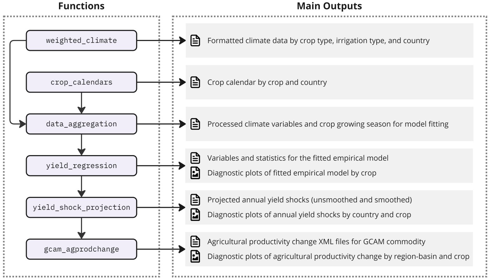

```{r setup, include=FALSE} 
knitr::opts_chunk$set(warning = FALSE, message = FALSE) 
```

<!-------------------------->
<!-------------------------->

<!-- HTML styles items    -->

<!-------------------------->
<!-------------------------->

```{=html}
<style>
.button {
  background-color: #555555;
  border-radius: 8px;
  border: none;
  color: white;
  padding: 15px 32px;
  text-align: center;
  text-decoration: none;
  display: inline-block;
  font-size: 16px;
  margin: 4px 2px;
  cursor: pointer;
}

.button:hover {
  box-shadow: 0 12px 16px 0 rgba(0,0,0,0.24), 0 17px 50px 0 rgba(0,0,0,0.19);
  background-color: #555555;
  color: gold;
}

p.comment {
background-color: #DBDBDB;
padding: 10px;
border: 1px solid black;
margin-left: 25px;
border-radius: 5px;
font-style: italic;
}

</style>
```


<!-------------------------->
<!-------------------------->

# Installation

<!-------------------------->
<!-------------------------->

<p align="center"></p>


1. Download and install:
    - R (https://www.r-project.org/)
    - R studio (https://www.rstudio.com/)  


2. Open R studio:

```r
install.packages("devtools")
devtools::install_github("JGCRI/gaia")
```

or

```r
install.packages("remotes")
remotes::install_github("JGCRI/gaia")
```

Additional steps for UBUNTU from a terminal

```
sudo add-apt-repository ppa:ubuntugis/ppa
sudo apt-get update
sudo apt-get install libudunits2-dev libgdal-dev libgeos-dev libproj-dev libmagick++-dev
```

Additional steps for MACOSX from a terminal

```
brew install pkg-config
brew install gdal
```

<br/>


<!-------------------------->
<!-------------------------->

# Workflow

<!-------------------------->
<!-------------------------->

<p align="center"></p>


`gaia` is designed with a climate-driven empirical model at its core, integrated into an efficient modular structure. This architecture streamlines the entire workflow. This workflow includes raw climate and crop data processing, empirical model fitting, yield shock projections under future climate scenarios, and agricultural productivity change calculation for GCAM. The modular design also facilitates comprehensive diagnostic outputs, enhancing the tool's utility for researchers and policymakers.


The primary functionality of `gaia` is encapsulated in the `yield_impact` wrapper function, which executes the entire workflow from climate data processing to yield shock estimation. Users can also execute individual functions to work through the main steps of the process ([Figure 1](#figure1)).


1. [`weighted_climate`](#weighted_climate): Processes CMIP climate NetCDF data in accordance with the [ISIMIP simulation protocols](https://www.isimip.org/protocol "Here we specifically require the bias-adjusted and statistically downscaled CMIP climate data following ISIMIP's protocols") and calculates cropland-weighted precipitation and temperature at the country level, differentiated by crop type and irrigation type. The function accepts both daily or monthly climate data in NetCDF format that follows ISIMIP protocols.

2. [`crop_calendars`](#crop_calendars): Generates crop planting months for each country and crop based on crop calendar data [Sacks et al., (2010)](https://doi.org/10.1111/j.1466-8238.2010.00551.x).

3. [`data_aggregation`](#data_aggregation): Calculates crop growing seasons using climate variables processed by `weighted_climate` and crop calendars for both historical and projected periods. This function prepares climate and yield data for subsequent model fitting.

4. [`yield_regression`](#yield_regression): Performs regression analysis fitted with historical annual crop yields, monthly growing season temperature and precipitation, CO2 concentrations, GDP per capita, and year. The default econometric model applied in `gaia` is from [Waldhoff et al., (2020)](https://doi.org/10.1088/1748-9326/abadcb). User can specify alternative formulas that are consistent with the data processed in `data_aggregation.`

5. [`yield_shock_projection`](#yield_shock_projection): Projects yield shocks for future climate scenarios using the fitted model and temperature, precipitation, and CO2 projections from the climate scenario.

6. [`gcam_agprodchange`](#gcam_agprodchange): Remaps country-level yield shocks to GCAM-required spatial scales (e.g., region, basin, and intersections), based on harvested areas, and aggregates crops to GCAM commodities. This function applies the projected shocks to GCAM scenario agricultural productivity growth rates (the unit used to project future yields in GCAM) and creates ready-to-use XML outputs for GCAM.

<br />

<p align="center"></p>
<a name="figure1"></a>
<p align="left" style="font-size:14px;"> **Figure 1:** The gaia workflow showing the functions and the corresponding outputs of modeling crop yield shocks to climate variations using empirical econometric model. </p>

<br />


<!-------------------------->
<!-------------------------->

# Example Climate Data

<!-------------------------->
<!-------------------------->

<p align="center"></p>


`gaia` requires global climate data from the Inter-Sectoral Impact Model Intercomparison Project ([ISIMIP](https://www.isimip.org/)) or data formatted according to ISIMIP protocols. Additionally, `gaia` supports climate data in both daily and monthly time step. Due to the large size of global climate data, we provide two types of example datasets tailored to different user needs.

* [Example Data 1](#example-data-1-quick-start-dataset): This pre-processed climate dataset allows users to quickly run `gaia` without the need to process raw climate NetCDF data. It is an output from the `gaia::weighted_climate` function, which converts raw climate NetCDF data into cropland-weighted climate data by country. This dataset includes both historical and future pre-processed cropland-weighted precipitation and temperature by country.  If you want to quickly test `gaia` and view the outputs, this is the easiest way to get started.
* [Example Data 2](#example-data-2-raw-climate-data): This climate dataset is designed for users who want to process raw climate NetCDF data using the `gaia::weighted_climate` function. It includes global monthly precipitation and temperature NetCDF files at a 0.5-degree resolution, covering the period from 2015 to 2100. Processing this data may take about an hour. If you intend to use your own climate datasets, this example will help you get set up.


<br />

## Example Data 1: Quick Start Dataset

Download the example data 1 using the instructions below. This dataset includes both historical climate observations and future climate projections, weighted by cropland areas and formatted in a tabular structure (see [Table 1](#table1)), as required by `gaia`. The cropland-area-weighted, country-level climate data contains monthly precipitation and temperature for 26 crop types, distinguishing between irrigated and rainfed areas.


```{r eval=F}

# load gaia
library(gaia)

# Path to the output folder. Change it to your desired location
output_dir <- 'gaia_output'

# Cropland-weighted historical and future climate data
data_dir <- gaia::get_example_data(
  download_url = 'https://zenodo.org/records/13976521/files/weighted_climate.zip?download=1',
  data_dir = output_dir
)

# Path to the folder that holds cropland-area-weighted precipitation and temperature TXT files
# historical climate observation
climate_hist_dir <- file.path(data_dir, 'climate_hist')
# future projected climate
climate_impact_dir <- file.path(data_dir, 'canesm5')

```


<br />

<div class="alert alert-info">
<strong>NOTE!</strong> The default example historical climate data provided in [example data 1](#example-data-1-quick-start-dataset) is based on WATCH climate observations ([Weedon et al., (2011)](https://doi.org/10.1175/2011JHM1369.1)), which were used in [Waldhoff et al., (2020)](https://doi.org/10.1088/1748-9326/abadcb) for empirical model fitting. If you do not intend to modify any assumptions or historical climate forcing for empirical model fitting, you can use the default regression model in `gaia`, which is pre-fitted with WATCH historical climate data, by setting the argument `use_default_coeff = TRUE`. After loading the `gaia` package, type `coef_default` to view the parameters of the default pre-fitted model. Alternatively, if you prefer to use different historical climate data other than the one from [example data 1](#example-data-1-quick-start-dataset), you can use `weighted_climate` function to generate cropland-weighted historical monthly precipitation and temperature following the [weighted_climate instruction](#weighted_climate) under Example 3.
</div>

<br />

## Example Data 2: Raw Climate Data

Download the example data 2 using the instructions below. This dataset includes future global monthly precipitation and temperature from 2015 to 2100 at 0.5-degree resolution. To use a different climate model or scenario, you can provide your own climate data in NetCDF format. Note that `gaia` adheres to the ISIMIP climate data format as its standard, so your NetCDF files should be formatted accordingly if the data is not directly downloaded from ISIMIP.


```{r eval=F}

# load gaia
library(gaia)

# Path to the output folder. Change it to your desired location
output_dir <- 'gaia_output'

# Future Climate Data
data_dir <- gaia::get_example_data(
  download_url = 'https://zenodo.org/records/13976521/files/gaia_example_climate.zip?download=1',
  data_dir = output_dir
)

# Path to the precipitation and temperature NetCDF files
# NOTE: Each variable can have more than one file
# projected climate data
pr_projection_file <- file.path(data_dir, 'pr_monthly_canesm5_w5e5_gcam-ref_2015_2100.nc')
tas_projection_file <- file.path(data_dir, 'tas_monthly_canesm5_w5e5_gcam-ref_2015_2100.nc')

```


<br />

<!-------------------------->
<!-------------------------->

# Run gaia!

<!-------------------------->
<!-------------------------->

<p align="center"></p>

## Example 1

<div class="alert alert-dismissible alert-warning">
  <button type="button" class="btn-close" data-bs-dismiss="alert"></button>
  <h4 class="alert-heading">Warning!</h4>
  <p class="mb-0">This example demonstrates the complete `gaia` model workflow, including processing the raw climate NetCDF data. Due to the large size of the climate dataset, this process may take up to an hour. For a quicker demonstration, please refer to [Example 2](#example-data-2-raw-climate-data).</p>
</div>

<!-- <div class="alert alert-info"> -->
<!-- <strong>NOTE!</strong> This example demonstrates the complete `gaia` model workflow, including processing the raw climate NetCDF data. Due to the large size of the climate dataset, this process may take up to an hour. For a quicker demonstration, please refer to [Example 2](#example-2). -->
<!-- </div> -->

This example guides users through the complete `gaia` workflow, from processing raw climate data to calculating yield shocks in response to future climate variations. Please note that we provide only the NetCDF files for *future* climate from [example data 2](#example-data-2-raw-climate-data). For historical model fitting, we use the pre-processed historical climate data from [example data 1](#example-data-1-quick-start-dataset) to reduce computational demands, especially for users without access to high-performance computing.

If you have your own historical climate data for model fitting, you can easily integrate it by specifying the paths to your historical precipitation and temperature NetCDF files using the `pr_hist_ncdf` and `tas_hist_ncdf` arguments, respectively. Be sure to set `climate_hist_dir = NULL` to bypass the pre-processed historical dataset.

You can run `gaia` using the single function `yield_impact` with our example data, which streamlines the entire workflow. For detailed explanations of each argument in `yield_impact`, please refer to the [reference page](https://jgcri.github.io/gaia/reference/yield_impact.html).

Intermediate outputs will be generated and saved to the user-specified output folder.


```{r eval=F, echo=T}

# load gaia
library(gaia)

# Path to the output folder. Change it to your desired location
output_dir <- 'gaia_output'

# Run gaia
# The full run with raw future climate data can take up to an hour
gaia::yield_impact(
  pr_hist_ncdf = NULL,                    # path to historical precipitation NetCDF file (must follow ISIMIP format); only if you wish to use your own historical precipitation observation
  tas_hist_ncdf = NULL,                   # path to historical temperature NetCDF file (must follow ISIMIP format); only if you wish to use your own historical temperature observation
  pr_proj_ncdf = pr_projection_file,      # path to future projected precipitation NetCDF file (must follow ISIMIP format)
  tas_proj_ncdf = tas_projection_file,    # path to future projected temperature NetCDF file (must follow ISIMIP format)
  timestep = 'monthly',                   # specify the time step of the NetCDF data (monthly or daily)
  climate_hist_dir = climate_hist_dir,    # path to the folder that holds cropland weighted historical climate observations
  historical_periods = c(1960:2001),      # vector of historical years selected for fitting
  climate_model = 'canesm5',              # label of climate model name
  climate_scenario = 'gcam-ref',          # label of climate scenario name
  member = 'r1i1p1f1',                    # label of ensemble member name
  bias_adj = 'w5e5',                      # label of climate data for bias adjustment for the global climate model (GCM)
  cfe = 'no-cfe',                         # label of CO2 fertilization effect in the formula (default is no CFE)
  gcam_version = 'gcam7',                 # output is different depending on the GCAM version (gcam6 or gcam7)
  use_default_coeff = FALSE,              # set to TRUE when there is no historical climate data available
  base_year = 2015                        # GCAM base year
  start_year = 2015,                      # start year of the projected climate data
  end_year = 2100,                        # end year of the projected climate data
  smooth_window = 20,                     # number of years as smoothing window
  co2_hist = NULL,                        # historical annual CO2 concentration. If NULL, will use default value
  co2_proj = NULL,                        # projected annual CO2 concentration. If NULL, will use default value
  diagnostics = TRUE,                     # set to TRUE to output diagnostic plots
  output_dir = output_dir                 # path to the output folder
)

```


<div class="alert alert-info">
<strong>NOTE!</strong> The arguments `climate_model`, `climate_scenario`, `member`, `bias_adj`, and `cfe` require specific strings that provide climate model metadata in the output files. These arguments do not impact the `gaia` model simulation itself; they are only used to populate climate data metadata in the outputs.
</div>

<br />

## Example 2

This example only uses the example of **weighted climate data** as described in [example data 1](#example-data-1-quick-start-dataset), which has been processed with cropland weights at the country level. This weighted climate data was generated using `gaia::weighted_climate`. This example serves as a guide to help users format their own data to match the weighted climate data structure if their raw climate data differs from the ISIMIP format. Running `gaia` directly with weighted climate data requires only a few minutes.

```{r eval=F, echo=T}

# load gaia
library(gaia)

# Path to the output folder. Change it to your desired location
output_dir <- 'gaia_output'

# Run gaia
gaia::yield_impact(
  climate_hist_dir = climate_hist_dir,    # path to the folder that holds cropland weighted historical climate observations
  climate_impact_dir = climate_impact_dir,# path to the folder that holds cropland weighted projected climate
  timestep = 'monthly',                   # specify the time step of the NetCDF data (monthly or daily)
  climate_model = 'canesm5',              # label of climate model name
  climate_scenario = 'gcam-ref',          # label of climate scenario name
  member = 'r1i1p1f1',                    # label of ensemble member name
  bias_adj = 'w5e5',                      # label of climate data for bias adjustment
  cfe = 'no-cfe',                         # label of CO2 fertilization effect in the formula (default is no CFE)
  gcam_version = 'gcam7',                 # output is different depending on the GCAM version (gcam6 or gcam7)
  use_default_coeff = FALSE,              # set to TRUE when there is no historical climate data available
  base_year = 2015,                       # GCAM base year
  start_year = 2015,                      # start year of the projected climate data
  end_year = 2100,                        # end year of the projected climate data
  smooth_window = 20,                     # number of years as smoothing window
  co2_hist = NULL,                        # historical annual CO2 concentration. If NULL, will use default value
  co2_proj = NULL,                        # projected annual CO2 concentration. If NULL, will use default value
  diagnostics = TRUE,                     # set to TRUE to output diagnostic plots
  output_dir = output_dir                 # path to the output folder
)

```


Explore the results in your output folder. For a detailed explanation of the output, checkout [Example 3](#example-3)!

<br />

## Example 3

Example 1 and 2 demonstrates how to use the wrapper function `yield_impact` to streamline the entire workflows shown in [Figure 1](#figure1). In Example 3, we provide additional instructions on using each function described in the [Workflow](#workflow) section with the example data and explain the associated outputs and diagnostic plots if any.

<br />

### weighted_climate

---

`weighted_climate` function calculates the cropland-weighted monthly precipitation and temperature for the projected climate. This function can be used if you wish to calculate cropland-weighted monthly precipitation and temperature using different climate forcing data. Please ensure that the climate NetCDF files follows the [ISIMIP simulation protocols](https://www.isimip.org/protocol "Here we specifically require the bias-adjusted and statistically downscaled CMIP climate data following ISIMIP's protocols"). Our [example data 1](#example-data-1-quick-start-dataset) includes the standard ISIMIP-style climate data for users to check the data structure and format.

The example below uses the monthly precipitation (mm) and temperature (degree C) projections from 2015 to 2100. To run this climate data processing, please provide the file paths for the precipitation and temperature NetCDF files using the `pr_ncdf` and `tas_ncdf` arguments, respectively, and adjust the other arguments accordingly to match the specifics of your climate data.

Please note that this step may take up to an hour to complete.

**Output of the function:** The function has no return values. It also writes the following output files to the `output_dir/weighted_climate` folder:

* `[climate-model]_[climate-scenario]_month_precip_country_irc_[crop-number]_[start-year]_[end-year].csv`: This file is the irrigated cropland-area weighted precipitation for certain climate model, scenario, and crop.

* `[climate-model]_[climate-scenario]_month_precip_country_rfd_[crop-number]_[start-year]_[end-year].csv`: This file is the rainfed cropland-area weighted precipitation for certain climate model, scenario, and crop.

* `[climate-model]_[climate-scenario]_month_tmean_country_irc_[crop-number]_[start-year]_[end-year].csv`: This file is the irrigated cropland-area weighted temperature for certain climate model, scenario, and crop.

* `[climate-model]_[climate-scenario]_month_tmean_country_rfd_[crop-number]_[start-year]_[end-year].csv`: This file is the rainfed cropland-area weighted temperature for certain climate model, scenario, and crop.


```{r eval=F, echo=T}
library(gaia)

# Path to the output folder where you wish to save the outputs. Change it accordingly
output_dir <- 'gaia_output'

# calculate weigted climate
weighted_climate(pr_ncdf = pr_projection_file ,
                 tas_ncdf = tas_projection_file ,
                 timestep = 'monthly',
                 climate_model = 'canesm5',
                 climate_scenario = 'gcam-ref',
                 time_periods = seq(2015, 2100, 1),
                 output_dir = output_dir,
                 name_append = NULL)

```

The example above will create a folder based on the specified `climate_model` argument (e.g., `output_dir/weighted_climate/canesm5`). Inside this folder, you will find files containing precipitation and temperature data weighted by the irrigated and rainfed cropland areas for 26 MIRCA crops at the country level. The file structure is organized in columns as follows: `[year, month, 1, 2, 3, ..., 265]`, where the numbers correspond to country IDs. To view the country names associated with these IDs, simply type `gaia::country_id` in the R console after loading the `gaia` package. Below is an example of the structure for the weighted precipitation data for rainfed soybean (`output_dir/weighted_climate/canesm5/anesm5_gcam-ref_month_precip_country_rfc_crop08_2015_2100.txt`).

```{r eval=T, echo=F, message=F, results='hide'}

input_climate <- gaia::input_data(folder_path = file.path(getwd(), 'vignetteFigs'),
                                  input_file = 'canesm5_gcam-ref_month_precip_country_rfc_crop08_2015_2100.txt')

```

<a name="table1"></a>
```{r eval=TRUE, echo=FALSE}
library(tibble)
library(kableExtra)
knitr::kable(input_climate[1:12], 
             caption = '**Table 1.** Soybean-area-weighted precipitation from the weighted_climate function.') %>% 
  kable_styling(bootstrap_options = "striped", full_width = T, position = 'center') %>% 
  footnote(general = 'This only shows the first 12 lines of the example data. Value -9999 indicates there is no cropland area for such crop in the country.')
```

<br />

### crop_calendars

---

The `crop_calendars` function calculate crop calendars based on the SAGE global crop planting and harvesting dates data ([Sacks et al., (2010)](https://doi.org/10.1111/j.1466-8238.2010.00551.x)).  The crop calendar outlines the planting and harvesting months for each predefined crop across all global countries. To run `crop_calendars` following the code below.

**Outputs of the function:** The function returns a data frame of crop calendars. It also writes the output in `output_dir/data_processed/crop_calendar.csv`  

```{r eval=F, echo=T}

# Path to the output folder where you wish to save the outputs. Change it accordingly
output_dir <- 'gaia_output'

# calculate crop calendars
crop_cal <- crop_calendars(output_dir = output_dir)

# print result
crop_cal

```


Below is an example of the crop calendar structure. You can also access the crop calendar output at `output_dir/data_processed/crop_calendar.csv`. The columns `[plant, harvest]` indicates the month of planting and harvesting for the crop with value 1 in the same row. For example, the first row in the table below indicates that the planting and harvesting month of wheat in Albania (iso = 'alb') is November and June. Users can filter to the certain crops by `filter(wheat == 1)` to better view the planting and harvesting month for countries with wheat.


```{r eval=T, echo=F, message=F, results='hide'}

crop_cal <- gaia::input_data(folder_path = file.path(getwd(), 'vignetteFigs'),
                              input_file = 'crop_calendar.csv')

```


```{r eval=T, echo=F}
library(dplyr)
library(kableExtra)
knitr::kable(crop_cal[1:10], 
             caption = '**Table 2.** Crop calendar') %>% 
  kable_styling(bootstrap_options = "striped", full_width = T, position = 'center') %>% 
  footnote(general = 'This only shows the first 10 lines of the example data.')
```


Users can customize the crop calendar by adding new crops to the file, ensuring they follow the established format. The code snippet below shows an example on how to add a crop to the crop calendar. Once you've updated the crop calendar, be sure to save the modified file by overwriting the existing crop calendar CSV in your output folder. This ensures the changes will be applied in the subsequent steps.


```{r eval=T, echo=T, message=F, results='hide'}

# adding a new crop: yams. Construct the structure of the data with yams
crop_add <- expand.grid(iso = c('cog', 'gha', 'lbr'),
                        crops = c(names(crop_cal)[2:(ncol(crop_cal) - 2)], 'yams')) %>%
  dplyr::mutate(value = ifelse(crops == 'yams', 1, 0)) %>% 
  tidyr::pivot_wider(names_from = 'crops', values_from = 'value', values_fill = 0)

# planting and harvesting month for countries with yams
crop_harvest_plant <- data.frame(iso = c('cog', 'gha', 'lbr'),
                                 plant = c(2, 2, 2),
                                 harvest  = c(9, 10, 9))

# complete the data structure with yams added
crop_add <- dplyr::left_join(crop_add, crop_harvest_plant, by = 'iso')

# bind the data to create updated crop calendars
crop_cal_update <- crop_cal %>% 
  dplyr::bind_rows(crop_add) %>% 
  tidyr::replace_na(list(yams = 0)) %>% 
  dplyr::select(-plant, -harvest, everything(), plant, harvest)

# view updated crop calendar
crop_cal_update

```

```{r eval=T, echo=F}
library(dplyr)
library(kableExtra)
knitr::kable(crop_cal_update[1:10], 
             caption = '**Table 3.** Updated crop calendar with yams') %>% 
  kable_styling(bootstrap_options = "striped", full_width = T, position = 'center') %>% 
  footnote(general = 'This only shows the first 10 lines of the example data.')
```

<br />

### data_aggregation

---

The `data_aggregation` function calculates crop growing seasons using climate variables processed by `weighted_climate` along with crop calendars for both historical and projected periods. This function prepares climate and yield data for subsequent model fitting.

**Outputs of the function:** The `data_aggregation` function returns a list of historical and projected weather variables and crop data. It also writes the following output files under the `output_dir/data_processed` folder:

* `historic_vars_[crop-name].csv`: This file summarizes **historical** harvest area (ha), irrigation type, annual yield (kg/ha), CO2 (ppm), growing season, precipitation (mm/month) and temperature (degree C) by country and crop. For example, historical information for soybean is illustrated in [Table 4](#table4). The `grow_season` column is binary and value 1 indicates the `grow_month` from the same row is considered growing season for the crop.

* `weather_[climate-model]_[climate-scenario]_[crop-name].csv`: This file includes aggregated **future** weather data for the specified climate model/climate scenario/crop. An example of climate data for soybean is shown in [Table 5](#table5). The output includes the minimum, maximum, and mean temperature, as well as precipitation, all calculated on a monthly basis for each year, based on the cropland-weighted monthly precipitation and temperature values.

```{r eval=F, echo=T}

# Path to the output folder where you wish to save the outputs. Change it accordingly
output_dir <- 'gaia_output'

# aggregate crop and climate information at the country level
data_agg <- data_aggregation(climate_hist_dir = climate_hist_dir,
                             climate_impact_dir = climate_impact_dir,
                             climate_model = 'canesm5',
                             climate_scenario = 'gcam-ref',
                             output_dir = output_dir)

```

The followings are example outputs and diagnostic plot from `data_aggregation` function.

```{r eval=T, echo=F, message=F, results='hide'}

crop_projection <- gaia::input_data(folder_path = file.path(getwd(), 'vignetteFigs'),
                                    input_file = 'weather_canesm5_gcam-ref_soybean.csv')

crop_hist <- gaia::input_data(folder_path = file.path(getwd(), 'vignetteFigs'),
                              input_file = 'historic_vars_soybean.csv')

```

<a name="table4"></a>
```{r eval=T, echo=F}
library(dplyr)
library(kableExtra)

knitr::kable(crop_hist[1:10], 
             caption = '**Table 4.** Aggregated historical information for soybean.') %>% 
  kable_styling(bootstrap_options = "striped", full_width = T, position = 'center') %>% 
  footnote(general = 'This only shows the first 10 lines of the example data.')
```

<br />

<a name="table5"></a>
```{r eval=T, echo=F}
library(dplyr)
library(kableExtra)

knitr::kable(crop_projection[1:10], 
             caption = '**Table 5.** Aggregated future weather information for soybean.') %>% 
  kable_styling(bootstrap_options = "striped", full_width = T, position = 'center') %>% 
  footnote(general = 'This only shows the first 10 lines of the example data.')
```

<br />

### yield_regression

---

The `gaia::yield_regression` function performs empirical model fitting and generates diagnostic plots comparing modeled yields to FAO recorded yields for each crop type at the GCAM region scale. 

**Outputs of the function:** The `yield_regression` function has no return value. It also writes the following output files:

* `reg_out_[crop-name]_[fit-name].csv`: This file is located under `output_dir/data_processed` folder and it contains the statistics of the regression analysis for a crop. [Table 6](#table6) show an example output of parameters of the fitted model for soybean.

* `weather_yield_[crop-name].csv`: This file is located under `output_dir/data_processed` folder and it contains the values of the variables in the regression formula (e.g., min, max, mean temperature).

* `model_[crop-name]_[fit-name].pdf`: This file is located under `output_dir/figures` folder and it is a diagnostic plot that shows model fitting between observed FAO data and fitted crop yield across global countries. An example of this comparison for soybean is illustrated in [Figure 2](#figure2).

```{r eval=F, echo=T}

# Path to the output folder where you wish to save the outputs. Change it accordingly
output_dir <- 'gaia_output'

# perform empirical regression
yield_regression(diagnostics = TRUE,
                 output_dir = output_dir)

```

The followings are example outputs and diagnostic plot from `yield_regression` function.

```{r eval=T, echo=F, message=F, results='hide'}

fit_model <- gaia::input_data(folder_path = file.path(getwd(), 'vignetteFigs'),
                              input_file = 'reg_out_soybean_fit_lnyield_mmm_quad_noco2_nogdp.csv')

```

<a name="table6"></a>
```{r eval=T, echo=F}
library(dplyr)
library(kableExtra)
knitr::kable(fit_model[1:10], 
             caption = '**Table 6.** Fitted model for soybean.') %>% 
  kable_styling(bootstrap_options = "striped", full_width = T, position = 'center') %>% 
  footnote(general = 'This only shows the first 10 lines of the example data.')
```

<br />

<a name="figure2"></a>
<p align="center"></p>
<p align="left" style="font-size:14px;"> **Figure 2:** Model fitted yields versus FAO yields for soybean. </p>

<br />

### yield_shock_projection

---

Once the `gaia` model has completed fitting, the `gaia::yield_shock_projection` function calculates the projected annual yield shocks based on the input climate data. For coarse-scale models like GCAM, `gaia` also computes smoothed yield shocks using a user-specified smoothing window (the default window is 20 years). In the smoothed outputs, the yield shocks at the base year will be set to 1. The results are provided in both `CSV` outputs and diagnostic plots.

**Outputs of the function:** The `yield_shock_projection` function returns a data frame of formatted smoothed annual crop yield shocks under climate impacts. It also writes the following output files:

* `yield_impacts_annual/yield_[climate-model]_[climate-scenario]_[crop-name].csv`: This file includes annual crop yield shocks under climate variability. An example of annual soybean yield shocks is shown in [Table 7](#table7).

* `yield_impacts_smooth/yield_[climate-model]_[climate-scenario]_[crop-name].csv`: This file includes smoothed annual crop yield shocks under climate variability. The default smoothing window is 20 years. An example of smoothed annual soybean yield shocks is shown in [Table 8](#table8).

* `annual_projected_climate_impacts_[climate-model]_[climate-scenario]_[crop-name]_[fit-name].pdf`: This is diagnostic plot for annual crop yield shocks for countries within different regions. It is located under `output_dir/figures` folder. A diagnostic plot of annual soybean yield shocks is illustrated in [Figure 3](#figure3).

* `smooth_projected_climate_impacts_[climate-model]_[climate-scenario]_[crop-name]_[fit-name].pdf`: This is diagnostic plot for smoothed annual crop yield shocks for countries within different regions. It is located under `output_dir/figures` folder.


```{r eval=F, echo=T}

# Path to the output folder where you wish to save the outputs. Change it accordingly
output_dir <- 'gaia_output'

# calculate projected yield shocks
out_yield_shock <- yield_shock_projection(use_default_coeff = FALSE,
                                          climate_model = 'canesm5',
                                          climate_scenario = 'gcam-ref',
                                          base_year = 2015,
                                          start_year = 2015,
                                          end_year = 2100,
                                          smooth_window = 20,
                                          diagnostics = TRUE,
                                          output_dir = output_dir)

```

The followings are example outputs and diagnostic plot from `yield_shock_projection` function.

```{r eval=T, echo=F, message=F, results='hide'}

annual_yield <- gaia::input_data(folder_path = file.path(getwd(), 'vignetteFigs'),
                                 input_file = 'annual_yield_canesm5_gcam-ref_soybean.csv')

smooth_yield <- gaia::input_data(folder_path = file.path(getwd(), 'vignetteFigs'),
                                 input_file = 'smoothed_yield_canesm5_gcam-ref_soybean.csv')

```

<a name="table7"></a>
```{r eval=T, echo=F}
library(dplyr)
library(kableExtra)

knitr::kable(annual_yield[1:10], 
             caption = '**Table 7.** Annual yield shocks for soybean.') %>% 
  kable_styling(bootstrap_options = "striped", full_width = T, position = 'center') %>% 
  footnote(general = 'This only shows the first 10 lines of the example data.')

```

<br />

<a name="table8"></a>
```{r eval=T, echo=F}
library(dplyr)
library(kableExtra)

knitr::kable(smooth_yield[1:10], 
             caption = '**Table 8.** 20-year smoothed yield shocks for soybean.') %>% 
  kable_styling(bootstrap_options = "striped", full_width = T, position = 'center') %>% 
  footnote(general = 'This only shows the first 10 lines of the example data.')

```

<br />

<a name="figure3"></a>
<p align="center"></p>
<p align="left" style="font-size:14px;"> **Figure 3:** Projected yield shocks for soybean. </p>

<br />

### gcam_agprodchange

---

The `gcam_agprodchange` function is specifically designed for the Global Change Analysis Model (GCAM) [(Calvin et al., 2019)](https://doi.org/10.5194/gmd-12-677-2019). GCAM requires the agricultural productivity growth rate (APG) as an input, which is calculated based on yield shocks and the baseline APG, varying according to different SSP scenarios. Additionally, the APG for GCAM must be at the region-basin scale. The `gaia::gcam_agprodchange` function directly remaps country-level yield shocks to region-basin APG. In the example below, since `climate_scenario = 'gcam-ref'`, it will use the APG without SSP impact (Reference scenario APC) to calculate the climate-impacted APG based on the yield shocks computed in the previous step.

**Outputs of the function:** The `gcam_agprodchange` function returns a data frame of agricultural productivity change. It also writes the following output files:

* `agyield_impact_[climate-model]_[ensemble-member]_[bias_adj]_[climate-scenario].xml`: This is the XML file of agricultural productivity change for all commodities for GCAM.

* `figures_yield_impacts/[commodity.png]`: This is diagnostic plot for yield shocks for a GCAM commodity at specified `gcam_timestep` (e.g., 5 years) by basins within each GCAM region (e.g., region-basin intersection) separated by irrigated and rainfed crop types.

* `figures_agprodchange/[commodity.png]`: This is diagnostic plot for APG for a GCAM commodity at specified `gcam_timestep` (e.g., 5 years) by basins within each GCAM region (e.g., region-basin intersection) separated by irrigated and rainfed crop types. An example of APG for soybean is shown in [Figure 4](#figure4) below.

```{r eval=F, echo=T}

# Path to the output folder where you wish to save the outputs. Change it accordingly
output_dir <- 'gaia_output'

# calculate region-basin agricultural productivity growth rate for GCAM
gcam_apg <- gcam_agprodchange(data = out_yield_shock,
                              climate_model = 'canesm5',
                              climate_scenario = 'gcam-ref',
                              member = 'r1i1p1f1',
                              bias_adj = 'w5e5',
                              cfe = 'no-cfe',
                              gcam_version = 'gcam7',
                              diagnostics = TRUE,
                              output_dir = output_dir)

```

<br />

Once the run is complete, a folder named `[gcam-version]_agprodchange_[cfe]` (e.g., `gcam7_agprodchange_no-cfe`) will be created in your specified output location. This folder contains the `XML` file of the agricultural productivity growth rate (APG) for GCAM. Additionally, it includes diagnostic figures illustrating the APG by region-basin. An example of APG for soybean is shown in [Figure 4](#figure4) below.

<a name="figure4"></a>
<p align="center"></p>
<p align="left" style="font-size:14px;"> **Figure 4:** Agricultural productivity growth rate for soybean. Each line under a region indicates the APG for the region-basin intersection. </p>

<br />

<a href="#top">Back to top</a>
